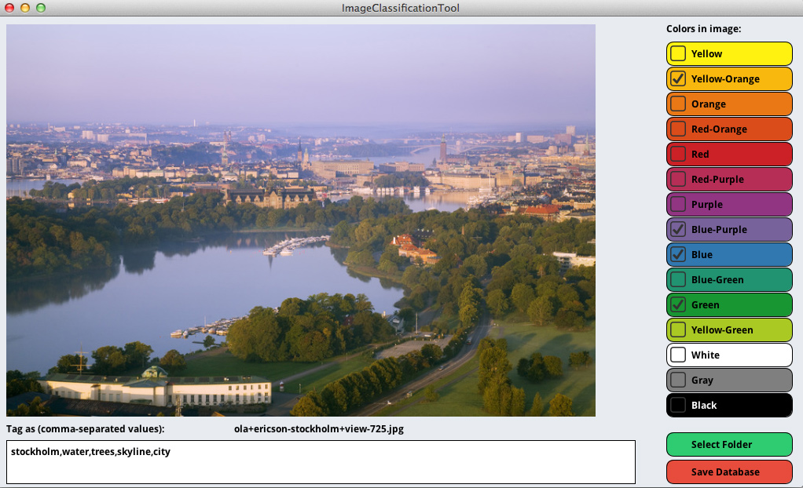

Image Classification Tool
==============

Description
--------------

Image Classification Tool is a tool to classify the content and colours of single images and folders with images. Image Classification Tool was written in Processing / Java. It allows users to save tags and colour classification information for each image in a SQLite database (to integrate it with other programming languages, e.g. Python and scikit-learn).

Screenshot
--------------

Motivation
--------------

I primarily wrote this program to tag and classify the colours and content of the McGill Calibrated Colour Image Database. 

http://tabby.vision.mcgill.ca/html/browsedownload.html

Tags
--------------
Colours, colors, Classification, Image Tagging, Data Sets, Pattern Recognition, Machine Learning, Processing, Graphical User Interfaces, ClickHandler, FileReader, TextArea, Buttons, SQLite.

Fork this repository, if ...
--------------

- you want to classify the content and colours of images
- you want to integrate Processing and SQLite
- you need basic GUI element like Buttons, Labels and TextInput for Processing
- you need to read files (especially images) from the file system
- you need to display images in various sizes with while keeping the aspect ratio

License
--------------

Image Classification Tool

2014 Hendrik Heuer <hendrikheuer@gmail.com>

GNU General Public License 3

This program is free software: you can redistribute it and/or modify it under the terms of the GNU General Public License as published by the Free Software Foundation, either version 3 of the License, or (at your option) any later version. This program is distributed in the hope that it will be useful, but WITHOUT ANY WARRANTY; without even the implied warranty of MERCHANTABILITY or FITNESS FOR A PARTICULAR PURPOSE.  See the GNU General Public License for more details. You should have received a copy of the GNU General Public License along with this program. If not, see <http://www.gnu.org/licenses/>.

